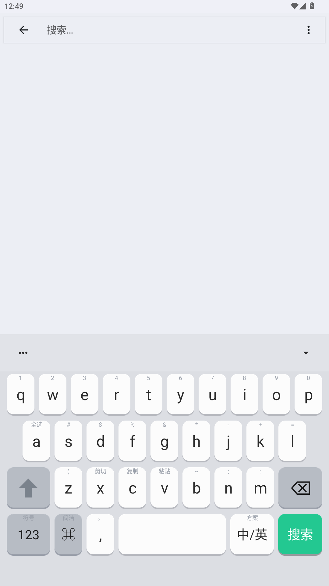
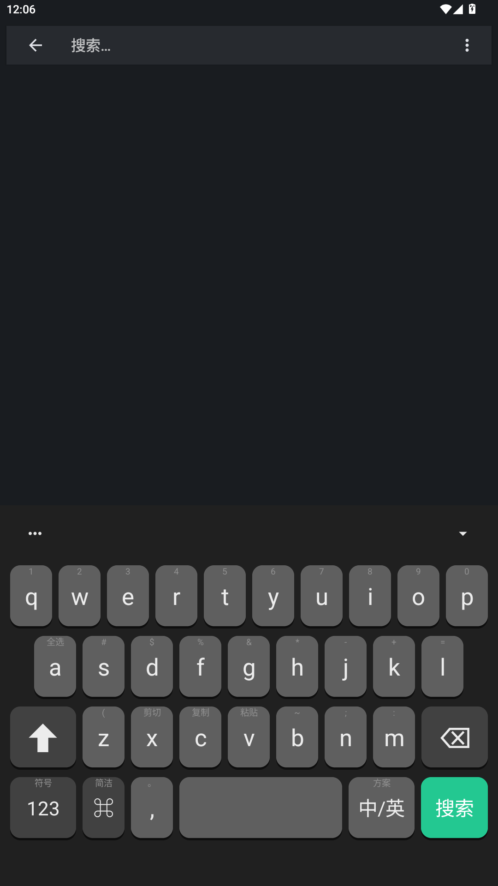

# 微信输入法风格皮肤 · 同文输入法（Trime）

仿微信输入法键盘的 Trime 主题，适配 Trime 3.3.x。

| 浅色                              | 深色                            |
| ------------------------------- | ----------------------------- |
|  |  |

## 特性

- 微信同款观感：白色圆角按键 + 底部阴影、灰色功能键、绿色回车 / 搜索键
- 浅色 / 深色两套配色，跟随系统自动切换
- Shift 三态（小写 / 大写 / 锁定）
- 按键长按提示：数字行、符号行、`x` `c` `v` 长按剪切 / 复制 / 粘贴、`a` 长按全选
- 回车键智能标签：搜索框显示「搜索」、普通输入显示「回车」、拼音未上屏显示「确定」
- 数字键盘 + 7 分类符号库（最近 / 中 / 英 / 《》 / 货币 / 数学 / 一二）

## 安装

1. 安装[同文输入法（Trime）](https://github.com/osfans/trime/releases)，并设为当前输入法
2. 把仓库文件复制到手机目录 `Android/data/com.osfans.trime/files/rime/`：
   - `trime-mint.trime.yaml` → 放到 `rime/` 下
   - `font.ttf`、`notosc.otf`、`HanaMinB.ttf`、`PlangothicP2-Regular.ttf` → 放到 `rime/fonts/` 下（没有 fonts 文件夹就新建一个）
   - `backgrounds/` 里的 6 张图片 → 放到 `rime/backgrounds/` 下
3. 打开 Trime 设置 → 键盘样式 → 主题 → 选择「微信输入法」
4. （可选）想跟随系统深浅模式：在 Trime 设置里打开「跟随系统深色」

## 字体

- `font.ttf`：**HarmonyOS Sans SC Medium**（华为发布的免费字体，可商用），键盘主字体（中粗字重）。
- `notosc.otf`：**Noto Sans CJK SC**（开源 OFL 许可），**兜底字体 1**——当主字体缺字时自动回退。
- `HanaMinB.ttf`：**花园明朝B**（开源字体），**兜底字体 2**——覆盖扩展 B～F 区（4 万多个超冷门汉字）。
- `PlangothicP2-Regular.ttf`：**遍黑体 P2**（开源 OFL 许可），**兜底字体 3**——补齐扩展 G/H 区（Unicode 最新区块的近万字），做到「一个都不缺」。
- 字体按 `font.ttf → notosc.otf → HanaMinB.ttf → PlangothicP2-Regular.ttf → 系统字体` 的顺序回退，四个都放在 `rime/fonts/` 目录内。
- 不需要自定义字体时可全部删除，会自动回退到系统字体。
- 字体版权归华为 / Google / 花园明朝项目所有，遵循各自的免费字体授权条款。

## 换设备 / 跨设备说明

本主题使用 dp 单位，**键盘的物理尺寸在所有设备上自动一致**（约 1.56 英寸高），一般手机安装后即可直接使用。

| 情况 | 说明 | 需要做什么 |
|---|---|---|
| 键盘占屏比例略有不同 | 大屏显小、小屏显饱满，属正常现象 | 不用管 |
| 候选字位置偏上/偏下 | 与「系统字体缩放」有关 | 把系统「字体大小」调成 **0.8×**，或把 `candidate_text_vertical_bias` 改成 ≈ 你的字体缩放倍数 |
| 键盘整体想更大/更小 | 调 `keyboard_height`（默认 244dp）即可 | 改一个数 |

> 「像素级相同」在 Android 上不可能实现（屏幕尺寸、显示大小、字体缩放均为每台设备的自由变量，主流输入法也一样）——
> 本主题的目标是：**到任何设备都「正常、协调、能用」**，这一点已达成。

